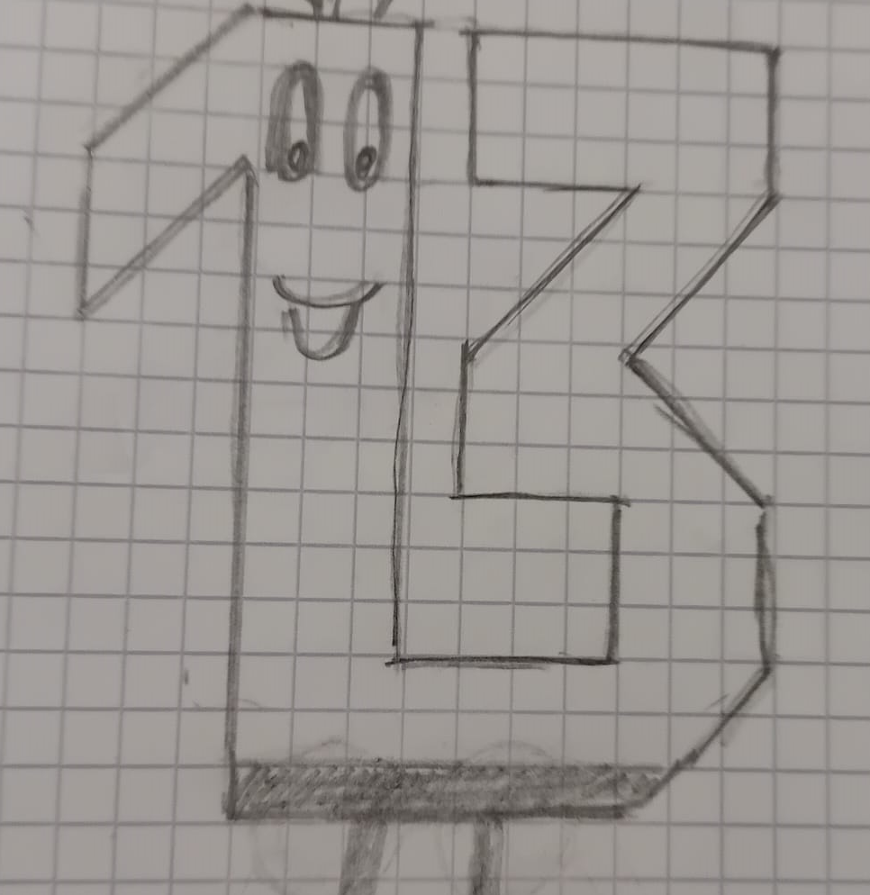
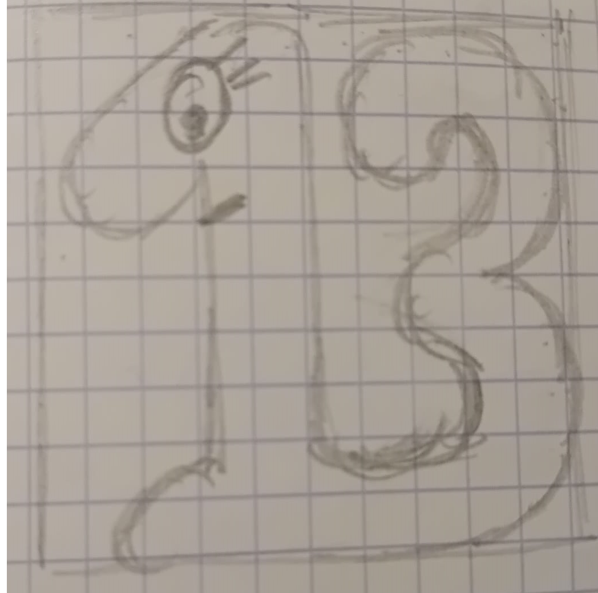
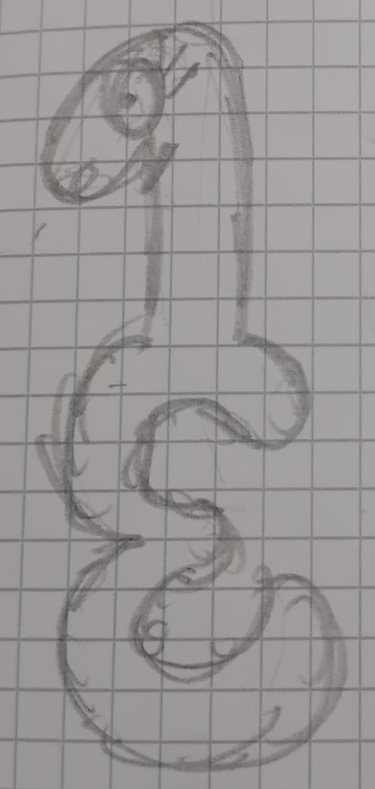

# Context
"Unloved 13" is my second game and my second submission to JS13K jam. 
It is based on a small JS game engine I created in 2023 which includes minimal features such as game loop, canvas rendering, mouse & keyboard events, synthetizer and audio sequencer. It weighs about 3.4Ko zipped and is very simple and flexible to use.

In 2024, prior to the competition, I added some "extensions" to this engine:
- Image extension: aims at reducing the size of the code for rendering images on 2d canvas
- Animation extension: provides an easy way to create animations on a sprite
- Song extension: aims at creating songs with a minimum of code

Link to MGE (Mini Game Engine): https://github.com/HomerDilpleu/MiniGameEngineJS

# Theme
This year theme was "triskaidekaphobia" which means "fear of number 13"... not an easy theme.

I was not very inspired by this theme, and, after 2 days, I decided to create a mini story where the player, "number 13", scares at the other numbers (because they have triskaidekaphobia) but wants to make them his friends.
At this stage it was obvious to me I had to create a platformer game to tell this story, although I had never done this before.

# Platformer basics
On August 15th, I started to create the platformer engine with:
- a "player" sprite controlled by the keyboard and subject to simple 2d physics (acceleration, velocity, position and gravity)
- a "platform" sprite that basically manages collisions with the player (more precisely, with 4 player hit boxes: lefft, right, up and down)
- a scrolling mechanism
- the capacity to "push" platforms

The collision part was, obviously, the most tricky part, and, even if it works decently, I'm not happy at all with my code, especially for collision resolutions. Instead of applying an impulse to resolve the collision, I move the player to its last position... which is ugly. 

Anyway, on August 18th, the game was looking like that:

https://github.com/user-attachments/assets/22a94c8f-a110-40c7-98e5-95b5c0cae954


# Number 13 graphics
The creation of the graphics for "number 13" has not been so simple and all the familly has participated :)

Here are some versions of the beast





# Level management
After having the prototype and the main character graphics, I focused on the level management.

For that I have created a specific "level" object in order to describe the components of the level:
- backgrounds (with a scroll ratio)
- platforms (size, position, background, behaviour,...)
- player (initial position)
- numbers (postion and behaviour)
- victory (end of level condition)
- camera (position and the begining of the level)

Level 1:
```
{
    _backgrounds:[{_id:'A',_width:6000,_height:7500,X:1000,Y:0,_scrollRatio:1,_fillStyle:game.patterns.violetBlockBright}],
    _platforms:[{_id:'16',_width:210,_height:30,X:2000,Y:3000,_fillStyle:game.patterns.violetBlockCircle,_radiusStyle:10,_movesTo:{X:1750,Y:3000,_velocityX:-50,_velocityY:0}},
                {_id:'1',_width:210,_height:30,X:2000,Y:3000,_fillStyle:'#582970',_radiusStyle:10},
                {_id:'1bis',_width:210,_height:30,X:2000,Y:3000,_actionable:{_message:'TEXT_BOX:NUMBER 45 IS SCARED OF THE SPIDER. HELP HIM!:640:50'}},
                {_id:'2',_width:400,_height:30,X:2300,Y:2900,_fillStyle:'#582970',_radiusStyle:10},
                {_id:'3',_width:30,_height:930,X:2510,Y:2400,_fillStyle:'#582970',_radiusStyle:10},
                {_id:'4',_width:530,_height:30,X:2300,Y:3100,_fillStyle:'#582970',_radiusStyle:10},
                {_id:'5',_width:90,_height:180,X:2650,Y:2920,_image:game.images.spider},
                {_id:'6',_width:210,_height:30,X:2000,Y:3200,_fillStyle:'#582970',_radiusStyle:10},
                {_id:'7',_width:240,_height:30,X:2300,Y:3300,_fillStyle:'#582970',_radiusStyle:10},
                {_id:'8',_width:500,_height:3300,X:2800,Y:540,_fillStyle:game.patterns.violetBlock},
                {_id:'9',_width:1630,_height:300,X:1195,Y:3525,_fillStyle:game.patterns.violetBlock},
                {_id:'10',_width:210,_height:30,X:2000,Y:3400,_fillStyle:'#582970',_radiusStyle:10},
                {_id:'11',_width:210,_height:30,X:2000,Y:2800,_fillStyle:'#582970',_radiusStyle:10},
                {_id:'12',_width:240,_height:30,X:2300,Y:2700,_fillStyle:'#582970',_radiusStyle:10},
                {_id:'13',_width:240,_height:30,X:2300,Y:2500,_fillStyle:'#582970',_radiusStyle:10},
                {_id:'14',_width:120,_height:10,X:2350,Y:2530,_fillStyle:'#d10c0c',_radiusStyle:[0,0,10,10],_actionable:{_message:'PLTF_MOVE:16'}},
                {_id:'17',_width:210,_height:30,X:1500,Y:3000,_fillStyle:'#582970',_radiusStyle:10},
                {_id:'18',_width:210,_height:30,X:1200,Y:2912,_fillStyle:'#582970',_radiusStyle:10},
                {_id:'19',_width:210,_height:30,X:1500,Y:2800,_fillStyle:'#582970',_radiusStyle:10},
                {_id:'20',_width:210,_height:30,X:1200,Y:2701,_fillStyle:'#582970',_radiusStyle:10},
                {_id:'21',_width:640,_height:30,X:1500,Y:2600,_fillStyle:'#582970',_radiusStyle:10},
                {_id:'23',_width:210,_height:30,X:1200,Y:2506,_fillStyle:'#582970',_radiusStyle:10},
                {_id:'22',_width:480,_height:3500,X:730,Y:600,_fillStyle:game.patterns.violetBlock},
                {_id:'24',_width:500,_height:30,X:1500,Y:2400,_fillStyle:'#582970',_radiusStyle:10},
                {_id:'25',_width:30,_height:120,X:1970,Y:2280,_fillStyle:'#a26ac8',_strokeStyle:'#582970',_radiusStyle:5,_pushable:{_Xmin:2015,_Xmax:2125,_Xfall:2020,_Yfall:2540,_fallSide:'right'}}],
    _player:{X:2100,Y:2930},
    _numbers:[{_id:'45',X:2600,Y:3065,
      _Xmin:2595,_Xmax:2605,_velocityX:60,
      _bodyFill:'#582970'}],
    _victory:{_plt:'5',_num:'Player'},
    _camera:{X:2300,Y:3200}}
```
and I have created a "initLevel" function that takes, as parameter, the above level object.


# FPS
To me the most difficult aspect of this project was to manage the FPS independently from the hardware. For example, with a 60Hz monitor, the browser FPS will be around 60 when, with a 120Hz monitor, the browser FPS will be around 120.

--> My first naive approach was to calculate the "deltaTime" between two frames and apply the physics more or less as follows:
- Xvelocity += Xacceleration * deltaTime
- X += Xvelocity * deltaTime

Well this does not work!

**Exemple of a constant acceleration of 1 with a frame each 0.1s**
- Time = 0s     --> Velocity = 0    --> X = 0
- Time = 0.1s   --> Velocity = 0.1  --> X = 0.1
- Time = 0.2s   --> Velocity = 0.2  --> X = 0.3
- Time = 0.3s   --> Velocity = 0.3  --> X = 0.6
- Time = 0.4s   --> Velocity = 0.4  --> X = 1

**Same but with a frame each 0.2s**
- Time = 0s     --> Velocity = 0    --> X = 0
- Time = 0.2s   --> Velocity = 0.2  --> X = 0.2
- Time = 0.4s   --> Velocity = 0.4  --> X = 0.6

So at time "0.4s", the object will be located at X=1 or X=0.6 depending on the FPS...

--> My second approach was to limit the FPS at 60 as follows

```
game.sprites.player.update = function () {
    // Elapsed time
    let elapsedTime = Date.now()-this.lastFrame

    // If elapsed time > 17ms (equivalent to 60 fps)
    if (elapsedTime>=0.017) {
        // Reset lastFrame time
        this.lastFrame = Date.now()
        this.updatePhysics(0.017)
    }
}
```

I think the logic is correct, however some players complained, in there reviews, that the game was not working with a 120Hz monitor. It's a shame I only have a 60Hz monitor and am not able to test it by myself :)

Anyway, I will deep dive into this topic and try to do better next year!


# Conclusion
I'm happy to have released something this year, it was a lot of work!

As it was my first attempt to create a platformer I have learnt a lot. 
I also have clearly identified what I should improve at this stage: mainly collision resolutions and FPS management. I will try to think about these topics before next year jam.

As last year, I found the community very cool with people willing to help and to share their experience!
Also I liked the new JS13K  backend, especially the capacity to upload and test the game as a "draft" before submitting it. Thanks Alkor!

Finally I have to thank my familly for their support, their ideas, their patience and for having tested deeply the game :)
