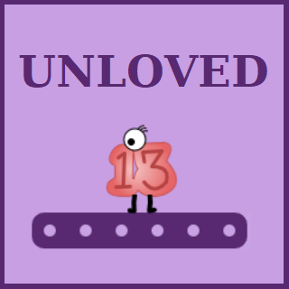

# Context
"Unloved 13" is my second game and my second submission to JS13K jam. 
It is based on a small JS game engine I created in 2023 which includes minimal features such as game loop, canvas rendering, mouse and keyboard events, synthetizer and audio sequencer. It weighs about 3.4Ko zipped and is very simple and flexible to use.

In 2024, prior to the competition, I added some "extensions" to this engine:
- Image extension: aims at reducing the size of the code for rendering images on 2d canvas
- Animation extension: provides an easy way to create animations on a sprite
- Song extension: aims at creating songs with a minimum of code

Link to MGE (Mini Game Engine): https://github.com/HomerDilpleu/MiniGameEngineJS

# Theme
This year theme was "triskaidekaphobia" which means "fear of number 13"... not an easy theme.

I was not very inspired by this theme, and, after 2 days, I decided to create a mini story where the player, "number 13", scares at the other numbers (because they have triskaidekaphobia) but wants to make them his friends.
At this stage it was obvious to me I had to create a platformer game to tell this story, although I had never done this before.

# Platformer game
On August 15th, I started to create the platformer engine with:
- a "player" sprite controlled by the keyboard and subject to simple 2d physics (acceleration, velocity, position and gravity)
- a "platform" sprite that basically manages collisions with the player (more preciseluy, with 4 hit boxes: lefft, right, up and down)
The collision

# Before the jam
As a beginner, I started to search information about game architecture, especially in a html5 & javascript context, I read a lot of tutorials and did some experiments with external libraries such as phaser and pixi.
It quickly appeared to me that I had to develop my own mini game engine because:

1/ it's fun and challenging

2/ I like to understand and master every single line of code

So I started to work on my MGE (Mini Game Engine) project in April 2023 during Easter holidays. In one week I had a first version with everything I wanted (game loop, mouse and keyboard inputs, sprites,...) except sound.

I then started to learn about the audio web API and created a simple synthetizer and a basic sequencer. To me the music part was the hardest topic to implement despite I previously had knowledge on sound synthesis.

Finally I created a little python script for code minification.

Link to MGE (Mini Game Engine): https://github.com/HomerDilpleu/MiniGameEngineJS

# August 13th - August 20th
The D day I was quite ready with my mini game engine available and plenty of energy to start working.

I loved this year theme "13th century" because it is concrete (not like some previous year themes as "404", "back" or "offline" that seem to me more challenging).
Very quickly,  maybe one hour after the theme was announced, it was clear to me I will create a game dealing with Cathedral building. This is because I wanted to highlight something positive of this period and I think cathedral building in one of the greatest achievment of the humanity.

I have visited a lot of cathedrals in my life as a tourist, but I never really looked at them closely and had no idea how they were build.
So I started to inform about gothic art and cathedrals. I have spent literally hours on the Web trying to understand the structure of a cathedral and how it is possible, just with stones, to build so high.
I learnt a lot  and I will now see the cathedrals with totally different eyes 👀

Anyway, I had the concept,  I had the technical knowledge, I knew more or less how a cathedral is built,... but how will my game look like? Will it be a clicker game, a strategic game, a puzzle,...? How the player will interact and what will he see?
I have really struggled with that and I did not anticipate how difficult it is to define a game play and a game design.
So I have spent one week just drawing on my handbook, trying different scenarios, exploring several gameplays, without writing any line of code...

At the end, I choosed to create a clicker game with a simple work flow (extract rock --> cut stone --> build) and the capacity to upgrade each element with gold. In addition the player will have random bonuses and auto click buttons.

In my mind, the fun part for the player is to see the cathedral being built progressively, so an important part of the project has been dedicated to the Cathedral rendering.

# August 21st - September 10th
Time for development !

After having initiated the project I have started to create a mini 3D rendering engine based on vanishing point perspective.
It allows rendering cubes (stones of our Cathedral) at a given position (x,y,z).
Well,... it's a quick and dirty solution, but it does the job!

Then I started to work on the structure of the Cathedral. From a technical point of view, it is very simple: the structure, stone by stone, is stored in an array and there is a "buildStones" function that draws the "x" next stones.
Stones are drawn in 4 offline canvas representing different player points of view (depth 110, 90, 50 and 0). The right canvas (depending on the mumber of stones already built) is then drawn on the main game canvas.

The most difficult part of the development was to populate the "structure" array in the "defineStructure" function.
To help me keeping ideas clear, I have drawn the  Cathedral in several Excel grids.

This was really the most complicated part of the project !

# Conclusion
I'm really happy to have released something to this challenge!

The good part is that I have learnt a lot during the game jam and I had lot of fun. The community is cool and I enjoyed seeing the progress of others developers in the Slack chat.

In another hand I did not anticipate how difficult the game design is (according to me more it is more difficult than coding) and the number of hours I had to spend the nigths of these 4 weeks. 💤

I hope you will enjoy the game, do not hesiate to give me your feedback!